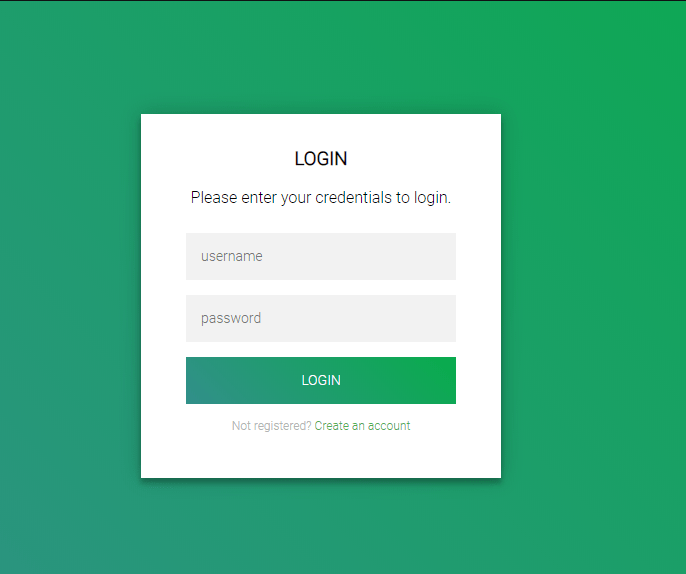

# Teste para candidatos à vagas de Front-End

O objetivo deste desafio é permitir uma melhor avaliação das suas habilidades como candidato à vaga de Front-end, de vários níveis. Este desafio deve ser feito por você em sua casa. Gaste o tempo que você quiser, porém consideramos ideal não gastar mais que 8h neste desafio.

## Como realizar o teste

- Faça um fork deste repositório em seu GitHub
- Adicione ao Readme uma descrição de como executar seu projeto
- Não há um limite de tempo, porém consideramos ideal não gastar mais que 8h neste desafio
- Faça commits parciais, para que possamos acompanhar o seu desenvolvimento.
- Em caso de dúvidas, entre em contato com eduardo.marcolino@gmail.com

## O Desafio

Este é o layout que deverá ser desenvolvido:

